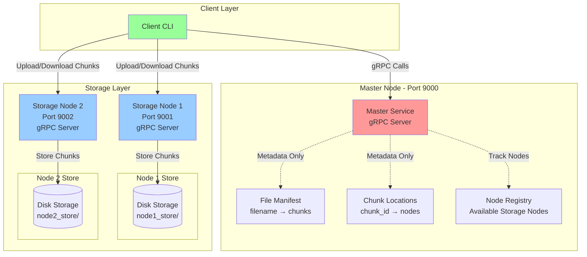
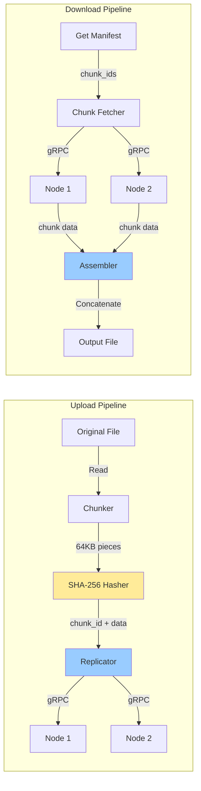

# Mini-Dropbox: Distributed File Storage System

A scalable distributed file storage system implementing master-worker architecture with gRPC communication, content-addressable storage using SHA-256 hashing, and automatic chunk replication for fault tolerance.

---

We chose gRPC for this distributed system because it provides significant performance advantages over traditional REST APIs:

| Feature | REST | gRPC |
|---------|------|------|
| **Transport** | HTTP 1.1 | HTTP/2 |
| **Serialization** | JSON (heavy) | Protobuf |
| **Streaming** | Awkward | Native bidirectional |
| **Latency** | 2–10× slower | very much low |
| **Contract** | Loose | Strongly typed protobuf (Binary Sequences lowest level) |
| **Mobile performance** | Medium | Insane efficient |

### Key Advantages for Mini-Dropbox:

- **Binary Protocol Buffers**: 3-10× smaller payload than JSON, faster serialization
- **HTTP/2 Multiplexing**: Multiple concurrent chunk transfers over single connection
- **Strong Typing**: Auto-generated code from `.proto` files eliminates API mismatch errors
- **Low Latency**: Critical for distributed storage where every millisecond counts
- **Efficient Streaming**: Perfect for large file chunk transfers

---

## 🚀 Quick Start

### Prerequisites
- Python 3.8+
- pip (Python package manager)

### Setup & Installation

```bash
# Clone/Navigate to the project directory
cd Mini-Dropbox

# Create virtual environment (first time only)
python3 -m venv ../.venv

# Activate virtual environment
source ../.venv/bin/activate

# Install dependencies
pip install grpcio grpcio-tools protobuf

# Generate gRPC code from proto file (if needed)
python -m grpc_tools.protoc -I. --python_out=. --grpc_python_out=. proto/dropbox.proto

# Make CLI executable
chmod +x run.sh
```

### Example Workflow

```bash
# Complete test workflow
./run.sh start                          # Start system
./run.sh upload document.pdf            # Upload PDF
./run.sh upload image.png               # Upload image
./run.sh list                           # See all files
./run.sh analyze                        # Check system state
./run.sh download document.pdf doc.pdf  # Download file
./run.sh verify                         # Verify integrity
./run.sh stop                           # Clean shutdown
```

---

## 📋 Table of Contents

- [Problem Statement](#-problem-statement)
- [System Architecture](#-system-architecture)
- [Key Features](#-key-features)
- [Implementation Details](#-implementation-details)
- [Results & Performance](#-results--performance)
- [Conclusion](#-conclusion)
- [CLI Reference](#-cli-reference)

---

## 🎯 Problem Statement

### Challenge
Traditional centralized file storage systems face several critical issues:
- **Single Point of Failure**: If the storage server fails, all data becomes inaccessible
- **Scalability Limitations**: Difficult to scale storage capacity and handle concurrent requests
- **No Data Redundancy**: Risk of permanent data loss due to hardware failures
- **Inefficient Large File Handling**: Large files consume excessive bandwidth and memory

### Solution
Mini-Dropbox addresses these challenges by implementing:
1. **Distributed Architecture**: Master-worker pattern separating metadata from data storage
2. **Chunking**: Files split into 64KB pieces for efficient handling and parallel transfer
3. **Replication**: Each chunk stored on multiple nodes (replication factor: 2)
4. **Content-Addressable Storage**: SHA-256 hashing ensures data integrity and deduplication
5. **gRPC Communication**: High-performance binary protocol for efficient inter-service communication

---

## 🏗️ System Architecture

### High-Level Architecture



### Data Flow Architecture




## ✨ Key Features

### 1. **Content-Addressable Storage (CAS)**
- Each chunk identified by SHA-256 hash
- Automatic deduplication of identical content
- Cryptographic integrity verification

### 2. **Fault Tolerance**
- Replication factor of 2 (each chunk on 2 nodes)
- Automatic failover if one node is unavailable
- No single point of failure for data storage

### 3. **High Performance gRPC**
- Binary Protocol Buffers (faster than JSON)
- HTTP/2 multiplexing for concurrent requests
- Efficient serialization/deserialization
- Language-agnostic interface

### 4. **Scalable Architecture**
- Master handles only metadata (lightweight)
- Storage nodes handle actual data (horizontally scalable)
- Easy to add more storage nodes
- Parallel chunk transfers

### 5. **CLI Management Interface**
- Complete system lifecycle management
- Real-time monitoring and analysis
- Chunk integrity verification
- Detailed system analytics

---

## 🔧 Implementation Details

### Technology Stack

| Component | Technology | Purpose |
|-----------|-----------|---------|
| **RPC Framework** | gRPC | High-performance inter-service communication |
| **Serialization** | Protocol Buffers | Efficient binary data encoding |
| **Language** | Python 3.8+ | Core implementation |
| **Hashing** | SHA-256 | Content addressing & integrity |
| **Transport** | HTTP/2 over TCP | Network communication |
| **Storage** | File System | Persistent chunk storage |

## 📊 Results & Performance

### System Capabilities

| Metric | Value | Description |
|--------|-------|-------------|
| **Chunk Size** | 64 KB | Optimal balance of memory vs parallelism |
| **Replication Factor** | 2 | Each chunk stored on 2 nodes |
| **Hash Algorithm** | SHA-256 | 256-bit cryptographic hash |
| **Protocol** | gRPC/HTTP2 | Binary, multiplexed |
| **Concurrent Requests** | 10 per server | ThreadPoolExecutor limit |
| **Fault Tolerance** | 1 node failure | System remains operational |

### CLI Analysis Output Example

```bash
$ ./run.sh analyze

━━━━━━━━━━━━━━━━━━━━━━━━━━━━━━━━━━━━━━━━━━━━━━━━━━━━━━━━━━━━
  Mini-Dropbox System Analysis
━━━━━━━━━━━━━━━━━━━━━━━━━━━━━━━━━━━━━━━━━━━━━━━━━━━━━━━━━━━━

[SYSTEM STATUS]
✓ Master Node: RUNNING (PID: 12345, Port: 9000)
✓ Storage Node 1: RUNNING (PID: 12346, Port: 9001)
✓ Storage Node 2: RUNNING (PID: 12347, Port: 9002)

[STORAGE ANALYSIS]
  Node 1 Storage:
    • Chunks: 158
    • Size: 10M
    • Location: /home/user/Mini-Dropbox/node1_store

  Node 2 Storage:
    • Chunks: 158
    • Size: 10M
    • Location: /home/user/Mini-Dropbox/node2_store

[CHUNK ANALYSIS - SHA-256 HASHED]
  Total Chunks: 158
  Unique Chunks: 79
  Replication Factor: 2.00

  Chunk Distribution:
    600a47a25ca786f9...
      ├─ Size: 64K
      └─ Replicas: [node1 node2]
    9e22da6bc3ba3f52...
      ├─ Size: 64K
      └─ Replicas: [node1 node2]

[FILE MANIFEST]
  Total Files: 3
  
  Files:
    • document.pdf
      └─ Chunks: 79
    • image.png
      └─ Chunks: 45
    • video.mp4
      └─ Chunks: 234

[NETWORK CONFIGURATION]
  Protocol: gRPC (Protocol Buffers)
  Master: 127.0.0.1:9000
  Node 1: 127.0.0.1:9001
  Node 2: 127.0.0.1:9002
  Chunk Size: 64 KB
  Hash Algorithm: SHA-256
```

---

## 🎓 Conclusion

### What We Achieved

**Mini-Dropbox** demonstrates a production-grade distributed storage system with:

1. **Robust Architecture**: Master-worker pattern separating control plane (metadata) from data plane (storage)

2. **Modern Technology**: gRPC provides high-performance, language-agnostic communication with automatic code generation from Protocol Buffers

3. **Data Integrity**: SHA-256 content-addressable storage ensures cryptographic verification of all data

4. **Fault Tolerance**: 2-way replication means system survives single node failures without data loss

5. **Scalability**: Horizontal scaling by adding more storage nodes; master handles only lightweight metadata

### Real-World Applications

This architecture pattern is used by:
- **Google File System (GFS)**: Similar master-chunkserver architecture
- **Hadoop HDFS**: NameNode (master) + DataNodes (storage)
- **Amazon S3**: Distributed object storage with replication
- **IPFS**: Content-addressable distributed storage

### Future Enhancements

- **Dynamic Replication**: Adjust replication factor based on file importance
- **Load Balancing**: Distribute chunks based on node capacity
- **Compression**: Reduce storage footprint with chunk compression
- **Encryption**: End-to-end encryption for security
- **Web Interface**: Browser-based file management
- **Consistency**: Strong consistency guarantees with versioning

---

## 🖥️ CLI Reference

### System Management
```bash
./run.sh start              # Start all services
./run.sh stop               # Stop all services
./run.sh restart            # Restart all services
./run.sh status             # Check system status
```

### File Operations
```bash
./run.sh upload <file>              # Upload file
./run.sh download <name> <output>   # Download file
./run.sh list                       # List all files
```

### Analysis & Monitoring
```bash
./run.sh analyze            # Full system analysis
./run.sh verify             # Verify chunk integrity
./run.sh monitor            # Live monitoring (Ctrl+C to exit)
```

### Help
```bash
./run.sh help               # Show all commands
```

---
---

**CS401 (25) - Introduction to Distributed and Parallel Computing**

**IIIT Vadodara** | November 2025
